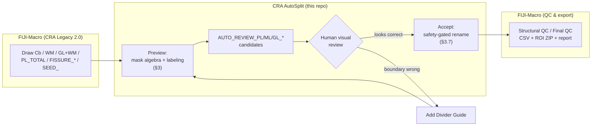

# CRA AutoSplit

**Marker-controlled geodesic partitioning of the cerebellar cortical ribbon
into per-lobule Purkinje- (PL), molecular- (ML), and granular-layer (GL) ROI
candidates, as a review-and-accept layer on top of the CRA Legacy
Fiji/ImageJ1 annotation workflow.**

CRA AutoSplit is a Fiji (ImageJ1) plugin, written in Java against the
`ij` API, that consumes hand-verified whole/total-tissue ROIs (`Cb`,
`WM`, `GL+WM`, `PL_TOTAL`) together with per-lobule anchor points and emits
mutually-exclusive, per-lobule PL/ML/GL layer masks as `AUTO_REVIEW_`
candidates for human review. It does not replace expert judgment: every
generated boundary is a *proposal*, gated behind an explicit visual-review
attestation and a set of automatically enforced safety invariants (§3.7)
before it can be promoted to a finalized ROI name.

This repository is one half of a two-part toolchain; the companion
[FIJI-Macro](https://github.com/idyllic486/FIJI-Macro) repository provides
the ROI-drawing/naming/QC macro toolbar (**CRA Legacy 2.0**) that produces
the inputs this plugin consumes, and consumes its outputs downstream.



## Table of contents

1. [Method](#1-method)
2. [Installation](#2-installation)
3. [Usage](#3-usage)
4. [Empirical validation](#4-empirical-validation)
5. [Known limitations & threats to validity](#5-known-limitations--threats-to-validity)
6. [Building from source](#6-building-from-source)
7. [Repository layout](#7-repository-layout)
8. [Related work](#8-related-work)
9. [License](#9-license)
10. [Suggested citation](#10-suggested-citation)

## 1. Method

### 1.1 Definitions and notation

Let `Ω` be the pixel lattice of the padded bounding box of `Cb`. For a
hand-drawn ROI `R`, let `μ(R) ⊆ Ω` denote its raster mask: the filled
interior for an area ROI, or a *w*-pixel-wide stroke along the traced path
for a line ROI (`w = 3` for `PL_TOTAL`, `w = 1` elsewhere). Nesting is
enforced before any subtraction, so a few stray pixels at a hand-drawn
boundary can never masquerade as a false island of tissue:

```
Cb  = μ(Cb_roi)
G   = μ(GL+WM_roi) ∩ Cb
W   = μ(WM_roi)    ∩ G
P   = μ(PL_TOTAL)  ∩ Cb
```

### 1.2 GL and the naive ML candidate

```
GL          = (G \ W) \ P
ML_candidate = Cb \ G \ P                      (derived; or, if a supplied
                                                 ML_TOTAL exists:
                                                 (μ(ML_TOTAL) ∩ Cb) \ P \ G)
```

`ML_candidate` is topologically correct but anatomically overcomplete: it
still contains any thin strip of tissue trapped between the *inner* edge of
`P` and the outer edge of `G` — the **inner-ML sliver** — whenever the
hand-traced PL band does not coincide exactly with the GL+WM boundary.

### 1.3 Why the sliver cannot be removed by hole-filling

`PL_TOTAL` is traced as **one continuous open curve** across the entire
visible cortical ribbon — it runs *through* every fissure rather than
closing into a separate loop per lobule. An open arc does not separate the
plane (the Jordan curve theorem requires a *closed* curve), so a
border-seeded flood fill over `P` alone can always route around the trace's
two true endpoints and reach every lobule's interior pocket. A naive
hole-filling pass (`fillHoles(P)`) therefore fills *nothing* for a
multi-lobule montage — this was verified as the root cause of a real defect
in this codebase (see [CHANGELOG.md](CHANGELOG.md)) and is the reason the
synthetic exclusivity test in §4.3, which used a *closed* synthetic PL band,
passed while the same logic failed on real montages.

### 1.4 ML reconstruction: endpoint sealing + pial-reachability flood fill

The fix seals `P`'s two open endpoints to `G` with a short barrier segment,
then keeps only the pixels of `ML_candidate` reachable from the pial
(outer-`Cb`) surface without crossing `P`:

```
seal(P)  = P ∪ {shortest 4-connected path from each open endpoint of P
                to the nearest pixel of G}

ML = { x ∈ ML_candidate : x is 4-connected, within ML_candidate,
       to ∂Cb without crossing seal(P) }
```

computed by a breadth-first flood fill seeded from every `ML_candidate`
pixel adjacent to `Ω \ Cb`. This is applied identically whether
`ML_candidate` came from a supplied `ML_TOTAL` or was derived — the
sliver is a byproduct of the flood-fill boundary, not a special case
handled per input source.

### 1.5 Barrier-constrained labeling and nearest-seed ownership

`PL`, `ML`, and `GL` are each partitioned into 8-connected components after
removing pixels under `FISSURE_`/`DIVIDER_` guide strokes (dilated to a
configurable width). Each component is claimed by the seed (anchor point)
with minimum squared Euclidean distance to any pixel of that component,
**subject to a parent constraint**: a component may not be claimed by a
seed whose `GL+WM`-connected tissue island differs from the component's own
— this keeps a geometrically nearby but tissue-disconnected fragment (e.g.
a detached paraflocculus) from being silently annotated under the wrong
lobule name. Guide-covered pixels are then back-filled to the nearest
already-owned pixel (ring search, radius = barrier width + 3 px), the
result is split once more per seed into connected pieces, and pieces
smaller than `max(minimumComponentArea, 2 % of that seed's largest piece)`
are dropped as noise and reported in the diagnostics log rather than
silently discarded.

### 1.6 Direct-vertex PL segmentation

When `PL_TOTAL` is a line, PL candidates are **not** produced by
rasterizing and skeletonizing. Instead, the identical barrier-constrained
ownership grid from §1.5 (computed over `P`) is queried at each *original*
traced vertex of `PL_TOTAL`. Consecutive vertices sharing an owner are
grouped; a group becomes one `PL_<region>_partN` candidate once its
polyline length exceeds a 3-pixel noise floor. Because no
rasterize→skeletonize→shortest-path round trip occurs, the emitted
candidate reproduces the operator's hand-traced coordinates exactly
(empirically, length ratio 1.001 — see §4.1). An area-type `PL_TOTAL`
still falls back to the legacy skeleton-centerline method, which remains
labeled *experimental* in the Preview dialog.

### 1.7 Safety invariants enforced before `Accept`

| Gate | Condition | Consequence if violated |
|---|---|---|
| Mutual exclusivity | `PL ∩ ML = PL ∩ GL = ML ∩ GL = ∅` (pixel count) | Hard failure — no candidates are emitted at all |
| Draft isolation | Outputs carry an `AUTO_REVIEW_` prefix | Never overwrites an existing finalized ROI |
| Coverage | ≥ 98.00 % of `PL ∪ ML ∪ GL` pixels assigned to some candidate | `Accept` refused |
| Manifest match | The `AUTO_REVIEW_` set in ROI Manager equals the most recent `Preview` output | `Accept` refused (blocks accepting stale/hand-edited candidates) |
| Completeness | Every requested seed × enabled-type combination produced ≥ 1 candidate | `Accept` refused, missing combinations listed |
| Name collision | No candidate's canonical name already exists as a finalized ROI | `Accept` refused, colliding names listed |
| Human attestation | Operator checks *"I visually checked every candidate boundary"* | `Accept` refused otherwise |
| Rollback | A full ROI Manager snapshot is saved (`..._PREACCEPT_<timestamp>.zip`) immediately before renaming | Always executed on `Accept` |

## 2. Installation

1. Quit Fiji completely.
2. Copy this repository's [`CRA_AutoSplit_A003_alpha4.jar`](CRA_AutoSplit_A003_alpha4.jar)
   into `Fiji.app/plugins/`. If an older `CRA_AutoSplit_A003_*.jar` is
   present, remove it or overwrite it with this file — two jars that
   define the same `cra.autosplit.*` classes on the plugin classpath can
   trigger a class-loader collision with non-deterministic results.
3. Optionally verify integrity:
   ```bash
   shasum -a 256 -c SHA256.txt
   ```
4. Restart Fiji. Installation is confirmed by the presence of
   `Plugins > CRA AutoSplit A003 alpha4`.

**Requirements:** Fiji (ImageJ 1.54p+), Java 8+ (Fiji's bundled JDK is
sufficient; no separate install needed).

## 3. Usage

### Workflow A — full automation (PL included), `SEED_`-anchored

1. Prepare `Cb`, `PL_TOTAL` (line), `WM`, `GL+WM`, `FISSURE_*` using CRA
   Legacy.
2. Multi-point tool → click once per lobule in anatomical order → **"1A.
   Add Seed Set"** → enter lobule names in click order, comma-separated
   (e.g. `Sim,Crus1,Crus2,PM,PFl,Fl`).
3. **"3. Validate Inputs"** → confirm no `ERROR`.
4. **"4. Generate Exclusive-layer Preview"** → enable PL/ML/GL candidate
   generation. (With a line `PL_TOTAL`, the checkbox reads *"Create PL
   candidates (direct split of PL_TOTAL's traced vertices)"* — §1.6.)
5. Visually inspect every PL (red) / ML (green) / GL (yellow) boundary.
6. For an incorrect split: draw a line across the boundary, **"2. Add
   Divider Guide"**, regenerate Preview.
7. **"5. Accept and Bulk-finalize Names"** once every candidate is correct.
8. Continue with CRA Legacy's Structural QC / Final QC / export.

### Workflow B — ML/GL only, existing local-PL preserved

If verified `PL_<lobule>_partN` ROIs (line or traced-area) already exist,
their names/positions are reused as anchors directly — no `SEED_` needed.
PL candidate generation is force-disabled in this mode so the operator's
already-finalized PL traces are never touched; only ML/GL are generated.

## 4. Empirical validation

Reports in [`VALIDATION/`](VALIDATION/) are development benchmarks against
a single held-out montage each — not an independent, multi-site accuracy
study. Read the counts below with that scope in mind.

### 4.1 Ground-truth comparison — sample `50M-43`

Seeds derived from the reference annotation's own GL centroids (isolates
boundary-generation performance from seed-placement performance).
Settings: `barrierWidth = 7 px`, `minimumComponent = 500 px`. Runtime
2217 ms, meaningful-layer coverage 98.93 %.

**ML pixel agreement** (macro Dice = 0.9358, macro IoU = 0.8804)

| Region | Manual px | Predicted px | ∩ px | Dice | IoU |
|---|---:|---:|---:|---:|---:|
| Crus1 | 998,876 | 1,148,777 | 998,316 | 0.9297 | 0.8686 |
| Crus2 | 706,404 | 800,172 | 705,408 | 0.9364 | 0.8805 |
| Fl | 465,189 | 576,806 | 465,145 | 0.8928 | 0.8064 |
| PFl | 838,668 | 915,318 | 838,249 | 0.9558 | 0.9154 |
| PM | 636,222 | 680,262 | 634,723 | 0.9643 | 0.9310 |

**GL pixel agreement** (macro Dice = 0.9980, macro IoU = 0.9961)

| Region | Manual px | Predicted px | ∩ px | Dice | IoU |
|---|---:|---:|---:|---:|---:|
| Crus1 | 863,680 | 860,565 | 860,320 | 0.9979 | 0.9958 |
| Crus2 | 693,798 | 694,337 | 693,697 | 0.9995 | 0.9989 |
| Fl | 456,499 | 456,465 | 456,465 | 1.0000 | 0.9999 |
| PFl | 903,668 | 901,175 | 901,175 | 0.9986 | 0.9972 |
| PM | 539,929 | 534,677 | 534,170 | 0.9942 | 0.9884 |

**PL length agreement**: total manual length 20,960.826 px vs. generated
20,982.003 px — ratio **1.0010**.

> **Scientific-honesty note.** This benchmark run predates the inner-ML
> sliver fix described in §1.3–1.4. Its raw candidate list shows exactly
> the defect that fix targets — every region emitted two ML *parts* (e.g.
> `Crus1_part1` = 57,518 px + `Crus1_part2` = 1,091,259 px) rather than one
> clean band. The Dice/IoU figures above are therefore a lower bound on
> what the current mask-algebra logic should achieve; they have **not yet
> been re-measured** against this repository's current build (which also
> includes the direct-vertex PL splitter, §1.6). Re-running this benchmark
> is open work — see [Known limitations](#5-known-limitations--threats-to-validity).

### 4.2 Anchor-compatibility test — sample `50M-51`

Confirms local-PL-derived anchoring (Workflow B, §3) and the completeness
gate (§1.7) behave as designed on a real, imperfect input set: 25 input
ROIs, 6 seeds inferred from existing local PL, 3 fissures, 0 errors, 0
mask-overlap pixels, 98.27 % assigned coverage. The engine correctly
*refused to fabricate* ML for `PM`/`PFl`/`Fl` and GL for `Sim`/`PM` where
fissures did not fully separate the tissue, surfacing
`"...has no candidate for <region>. Add/extend a fissure or move the
seed."` instead of guessing — the completeness gate (§1.7) would have
blocked `Accept` on this input until corrected.

### 4.3 Synthetic topology / exclusivity test

Headless test against `ij-1.54g.jar` with a 100×100 px synthetic `Cb`, a
40×40 px `GL+WM`, and a **closed** 50×50 px synthetic `PL_TOTAL` band.

| Case | Expected | Observed | Result |
|---|---|---|---|
| Derived `ML_TOTAL` area | 10,000 − 2,500 = 7,500 px | 7,500 px | PASS |
| Supplied `ML_TOTAL` precedence | supplied mask used | supplied mask used | PASS |
| `PL ∩ ML` | 0 px | 0 px | PASS |
| `PL ∩ GL` | 0 px | 0 px | PASS |
| `ML ∩ GL` | 0 px | 0 px | PASS |

Because this synthetic `PL_TOTAL` is a *closed* band, it does not exercise
the open-curve failure mode described in §1.3 — this is precisely why the
test suite did not catch the sliver defect before real-montage testing did
(§4.1). A closed-vs-open-curve regression case is open work.

## 5. Known limitations & threats to validity

- Fissures that do not fully separate a connected tissue component may
  leave some lobule candidates ungenerated; add/extend a `DIVIDER_` guide.
- Direct-vertex PL segmentation (§1.6) applies only when `PL_TOTAL` is a
  line **and** anchors come from `SEED_` points. Under Workflow B (local-PL
  anchors), PL generation stays disabled to preserve already-finalized
  traces.
- For an area/band `PL_TOTAL`, PL candidate generation still uses the
  lossier skeleton-centerline fallback and defaults to off.
- §4.1's Dice/IoU/length figures were measured on the pre-sliver-fix,
  pre-vertex-split engine build; they have not yet been re-collected
  against the current code.
- All validation is single-montage development benchmarking, not
  independent or multi-site biological accuracy evaluation.
- The synthetic exclusivity test's `PL_TOTAL` fixture is a closed curve
  and therefore does not regression-test the open-curve failure mode that
  motivated §1.3–1.4.

## 6. Building from source

No Maven/Ant is used; Fiji's bundled JDK is sufficient:

```bash
FIJI=/path/to/Fiji.app        # folder containing the Fiji executable
JAVAC="$FIJI/java/*/*/*/bin/javac"   # actual path varies by platform — check Fiji/java in Finder
IJ_JAR="$FIJI/jars/ij-*.jar"

mkdir -p build/classes
javac -encoding UTF-8 --release 8 -cp $IJ_JAR -d build/classes SOURCE/*.java
cp SOURCE/plugins.config build/classes/
cd build/classes && jar cf ../CRA_AutoSplit_A003_alpha4.jar plugins.config cra
```

Drop the resulting jar into `Fiji.app/plugins/` and restart Fiji.

## 7. Repository layout

```
CRA-AutoSplit/
├── CRA_AutoSplit_A003_alpha4.jar   # ready-to-install build
├── SHA256.txt                      # checksum of the jar above
├── SOURCE/
│   ├── AutoSplitEngine.java        # mask algebra, labeling, ROI generation (§1)
│   ├── CRAAutoSplitPlugin.java     # ImageJ1 UI, ROI Manager integration, safety gates (§1.7)
│   └── plugins.config              # ImageJ plugin registration
└── VALIDATION/                     # development benchmark reports (§4)
```

## 8. Related work

- [FIJI-Macro](https://github.com/idyllic486/FIJI-Macro) — the CRA Legacy
  2.0 toolbar/macro set that defines the ROI naming convention and QC
  pipeline this plugin's inputs and outputs conform to.

## 9. License

[MIT](LICENSE)

Changelog: [CHANGELOG.md](CHANGELOG.md)

## 10. Suggested citation

```
idyllic486. CRA AutoSplit (A003 alpha4) [Computer software].
https://github.com/idyllic486/CRA-AutoSplit
```
